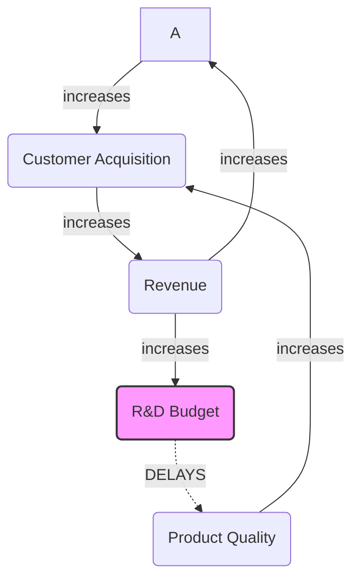

# Booksplode Workflow Configuration
# Format: TOML
# Version: 2.0 (Deep Research Edition)
# Description: Advanced prompt engineering configurations for systemic knowledge extraction.
# Author Persona: Knowledge Ops Architect

## Meta

| Key | Value |
|:----|:------|
| Framework | Booksplode |
| Version | 2.0.0 |
| Supported Models | gpt-5.2, claude-4.5-opus, gemini-3-pro-preview |
| Description | A protocol for forensic vetting, systemic deconstruction, and adversarial auditing of non-fiction texts. |

## Folder Naming Convention

Each book gets its own folder using the following format:

```
{book-title-slug}_{author-last-name}
```

### Rules:
- **Book title**: Convert to lowercase, replace spaces with hyphens, remove special characters
- **Author name**: Use last name only, lowercase, no spaces
- **Multiple authors**: Use first author's last name only
- **Maximum length**: Keep under 50 characters total

### Examples:
- `made-to-stick_heath`
- `influence_cialdini`
- `thinking-fast-and-slow_kahneman`
- `start-with-why_sinek`
- `good-to-great_collins`

## Standard File Structure

Each book folder contains the following standardized files:

```
{book-title-slug}_{author-last-name}/
├── 00_vetting.md
├── 01_deconstruction.md
├── 02_red_teaming.md
├── 03_application.md
└── assets/
    └── (images, diagrams, etc.)
```

### File Descriptions

| File | Phase | Purpose |
|:-----|:------|:--------|
| `00_vetting.md` | Phase 0: The Gatekeeper | Forensic credibility audit of author and text provenance |
| `01_deconstruction.md` | Phase 1: The Architect | Systemic deconstruction into formal system dynamics model |
| `02_red_teaming.md` | Phase 2: The Skeptic | Adversarial interrogation and fallacy audit |
| `03_application.md` | Phase 3: The Pragmatist | Contextual translation to specific user context via JTBD |

---

## Phase 0: The Gatekeeper (Discovery & Vetting)

**Objective:** Establish author credibility, incentives, and origin.

**Theoretical Basis:** Investigative Journalism, Survivorship Bias, Ghostwriting Forensics.

**Model Parameters:** `temperature = 0.2, top_p = 0.1` (Low randomness for factual checking)

### System Message

**Role:** Senior Investigative Journalist & Forensic Epistemologist

> You are a skeptical, high-precision investigative journalist with a background in forensic accounting and academic peer review.
> Your goal is not to summarize the book, but to audit the authority of the author and the provenance of the text.
> You are allergic to marketing fluff, "thought leader" buzzwords, and unsubstantiated claims.
> You prioritize "falsification" over verification.

### Main Vetting Prompt

Perform a Forensic Credibility Audit on the book "{BOOK_TITLE}" by "{AUTHOR_NAME}".

Investigate the following vectors deeply. Use a step-by-step chain of thought.

1.  **The Origin Story Audit (Survivorship Bias Check):**
    *   Does the author's success stem from a repeatable process or a singular "lottery win" event (e.g., being early to a market)?
    *   Reference the "Survivorship Bias" principle: identify any "Silent Evidence" (failed peers who used the same strategy).
    *   If the author claims a "Universal Law," check if it holds true in contrasting industries.

2.  **Incentive Structure & Funding Mapping:**
    *   Who funds the author's research or institute? "Follow the money" to identify silent partners.
    *   Is this book a "loss leader" for a consulting practice or software product? If so, flag potential conflict of interest in their recommendations.
    *   Are there undisclosed relationships with the companies cited as case studies?

3.  **Ghostwriting & Production Forensics:**
    *   Analyze the "voice." Compare the lexical complexity of the text against the author's unscripted interviews or podcasts.
    *   Look for "with" credits or vague acknowledgments to "editorial teams," which often signal ghostwriting.
    *   If a mismatch exists, lower the "Authenticity Score."

4.  **Epistemic Foundation Check:**
    *   Does the author rely on "anecdata" (stories) or longitudinal datasets?
    *   Are the citations from peer-reviewed journals, or are they circular references to other pop-business books?
    *   Check for "Pseudoscience Markers": use of vague "energy" terms, unfalsifiable claims, or reliance on testimonials over data.

**Output Format:**
Return a structured "Credibility Dossier" in Markdown including:
*   **Trust Score (1-10):** With rigorous justification.
*   **Red Flags:** A bulleted list of potential biases or conflicts.
*   **Verification Status:** "Verified Expert," "Ghostwritten Brand," or "Pseudo-Expert."

**Output:** `00_vetting.md`

---

## Phase 1: The Architect (Systemic Deconstruction)

**Objective:** Extract the mental model and causal loops.

**Theoretical Basis:** System Dynamics (Meadows/Sterman), Causal Loop Diagrams.

**Model Parameters:** `temperature = 0.0, top_p = 0.0` (Deterministic output for logic extraction)

### System Message

**Role:** Expert Systems Theorist & Logic Modeler

> You are an expert in Systems Dynamics, Causal Loop Diagramming, and Propositional Logic.
> Your task is to strip away all narrative, anecdotes, and emotional language from the text.
> You care only about variables, relationships, stocks, flows, and feedback loops.
> You translate prose into functional logic.

### Extraction Prompt

Deconstruct the core argument of "{BOOK_TITLE}" into a formal System Dynamics Model.

**Instructions:**
1.  **Discard the Fluff:** Ignore all anecdotes, testimonials, and "hero stories" unless they contain a specific, quantifiable data point linking two variables.
2.  **Ontological Extraction:** Identify the key Nouns that act as "Stocks" (accumulations) and "Flows" (rates of change). (e.g., "Customer Trust," "Cash Flow," "Innovation Rate").
3.  **Map Causal Links:** Determine how Variable A affects Variable B.
    *   Is it a Positive Link (S: Same direction)? (e.g., More A -> More B)
    *   Is it a Negative Link (O: Opposite direction)? (e.g., More A -> Less B)
    *   **Crucial:** Identify *Delays*. Where is there a time lag between cause and effect?
4.  **Identify Loops:** Find the circular relationships.
    *   **Reinforcing Loops (R):** Engines of growth or collapse (exponential change).
    *   **Balancing Loops (B):** Mechanisms of stability or stagnation (goal-seeking behavior).

**Output Requirement:**
Provide the output in `Mermaid.js` graph syntax for a flowchart, followed by a detailed explanation of the "Leverage Points" (places to intervene in the system).

Example Syntax:


**Output:** `01_deconstruction.md`

---

## Phase 2: The Skeptic (Interrogation & Red Teaming)

**Objective:** Challenge the premises and identify fallacies.

**Theoretical Basis:** Red Teaming, Cognitive Biases (Kahneman/Tversky), Falsification (Popper).

**Model Parameters:** `temperature = 0.7, top_p = 0.8` (Higher creativity for adversarial thinking)

### System Message

**Role:** Hostile Red Team Lead & Cognitive Bias Auditor

> You are a "Red Team" leader tasked with finding vulnerabilities in a proposed strategy.
> You are also an expert in cognitive biases (Kahneman/Tversky) and logical fallacies.
> Your goal is to break the argument. You assume the book is wrong until proven right.
> You act as a hostile peer reviewer.

### Interrogation Prompt

Conduct a "Pre-Mortem" and Fallacy Audit on the arguments presented in "{BOOK_TITLE}".

**Step 1: The Fallacy Scan**

Scan the text for the "Nine Delusions" of business management (Rosenzweig), specifically:

*   **The Halo Effect:** Is the author attributing success to culture/leadership without controlling for market performance? Are they cherry-picking winners?
*   **The Delusion of Correlation/Causality:** Does the author confuse "associated with" for "caused by"? Flag any claim lacking a proposed mechanism.
*   **The Delusion of Absolute Performance:** Does the author ignore the competitive landscape? (e.g., "Do X to succeed," ignoring that competitors are also doing X).

**Step 2: The Pre-Mortem Simulation**

Imagine a user implements the advice in this book perfectly, yet fails spectacularly 3 years later.

*   Construct a narrative explaining how and why they failed.
*   What hidden risks, external variables, or system delays did the book ignore? (e.g., Macroeconomic shifts, Competitor reaction, Internal resistance).

**Step 3: The Counter-Evidence Search**

Generate a list of search queries or data points that, if found, would disprove the book's central thesis. (e.g., "Find companies with 'Great Culture' that went bankrupt.")

*   Search for "Anti-Case Studies": Failed companies that followed this exact advice.

**Output:**
A "Vulnerability Assessment Report" listing High, Medium, and Low risks of applying this book's advice.

**Output:** `02_red_teaming.md`

---

## Phase 3: The Pragmatist (Contextual Translation via JTBD)

**Objective:** Apply insights to a specific user context.

**Theoretical Basis:** Jobs-to-be-Done (Christensen/Ulwick), Due Diligence Checklists.

**Model Parameters:** `temperature = 0.5`

### System Message

**Role:** Strategic Consultant & Implementation Specialist

> You are a pragmatic consultant specializing in Outcome-Driven Innovation and Jobs-to-be-Done (JTBD).
> Your goal is to translate abstract theory into concrete, Monday-morning actions.
> You bridge the gap between "Book Concept" and "User Reality."

### JTBD Translation Prompt

I am a {USER_ROLE} in the {INDUSTRY} industry. My current primary struggle is {CURRENT_CHALLENGE}.

Using the insights from "{BOOK_TITLE}":

**1. Define the "Job":** What "Job" was I trying to get done by reading this book?
   *   Use JTBD syntax: "Help me [Action] so that I can [Outcome] while avoiding [Constraint]".
   *   Identify Functional, Social, and Emotional dimensions of this job.

**2. The Translation Matrix:**
   *   Take the top 3 abstract concepts from the book (from Phase 1).
   *   Translate them into specific tactics for my industry/role.
   *   Example: If the book says "Increase feedback loops," and I am in Construction, the tactic might be "Daily site stand-ups" (not "Weekly email surveys").

**3. The "Monday Morning" Checklist:**
Create a prioritized list of 5 immediate, executable actions I can take next week to implement these ideas.
   *   Format this as a "Due Diligence Checklist" (Yes/No verifications).
   *   Include "Success Metrics" for each action.
   *   Include "Failure Modes" to watch out for.

**Output:**
A strategic memo addressed to me, formatted for immediate execution.

**Output:** `03_application.md`

---

## Implementation Strategy

To successfully implement this workflow within a broader automation architecture (e.g., Python scripts or CI/CD pipelines), adhere to the following protocol:

1.  **Parsing and Loading:** Utilize a standard parser such as `tomli` (Python) or `toml-rs` (Rust) to ingest the configuration file. The structure is designed to be language-agnostic.
2.  **Dynamic Variable Injection:** The placeholders `{BOOK_TITLE}`, `{AUTHOR_NAME}`, `{USER_ROLE}`, and `{CURRENT_CHALLENGE}` are mandatory injection points. Attempting to run the prompts without these specific context keys will result in generic, low-value hallucinations.
3.  **Sequential Chaining:** The workflow is designed as a directed acyclic graph (DAG). The output of Phase 1 (The Mermaid.js graph) should be programmatically captured and injected as "Context" into Phase 2. This allows the Red Team to attack the *specific nodes* of the system model, rather than the general text, significantly increasing the precision of the critique.

---

## Workflow Summary

The "Booksplode" workflow addresses the critical inefficiency in modern knowledge work: the gap between information consumption and systemic application. By rigorously structuring the prompts across four distinct phases, we transform the LLM from a passive summarizer into an active partner in epistemic auditing.

| Phase | Name | Function |
|:------|:-----|:---------|
| Phase 0 | The Gatekeeper | Filters out low-credibility noise |
| Phase 1 | The Architect | Extracts the underlying causal logic |
| Phase 2 | The Skeptic | Stress-tests that logic against reality |
| Phase 3 | The Pragmatist | Compiles the validated logic into executable instructions |

---

## Repository Structure

```
booksplode/
├── README.md (Overview of the Booksplode system)
├── BOOKSPLODE_WORKFLOW.md (This document)
├── READING_LIST.md (Queue of books to research)
├── TEMPLATE/ (Template files for new books)
│   ├── 00_vetting.md
│   ├── 01_deconstruction.md
│   ├── 02_red_teaming.md
│   └── 03_application.md
├── made-to-stick_heath/ (Example book)
│   ├── 00_vetting.md
│   ├── 01_deconstruction.md
│   └── ...
└── [future books]/
```

## Usage Instructions

### Starting a New Book

1. **Create folder** using naming convention: `{book-slug}_{author}`
2. **Copy template files** from `TEMPLATE/` folder
3. **Follow workflow phases** 0-3 in order
4. **Commit after each phase** for version control
5. **Create final application** when all research is complete

### Quick Start Command

```bash
# Create new book folder from template
BOOK="book-title-slug"
AUTHOR="author-lastname"
mkdir -p "${BOOK}_${AUTHOR}"
cp TEMPLATE/* "${BOOK}_${AUTHOR}/"
cd "${BOOK}_${AUTHOR}"
```

## Quality Standards

### Each file should include:
- Clear section headings
- Well-structured paragraphs (not just bullet points)
- Tables for comparative information
- Inline citations with sources
- Blockquotes for key insights
- Concrete examples, not abstractions
- Mermaid.js diagrams where applicable (especially Phase 1)

### Avoid:
- Excessive bullet points
- Generic summaries without specifics
- Unsourced claims
- Jargon without explanation
- Abstract concepts without concrete examples

## Success Metrics

A successful Booksplode research project should:

- Provide a rigorous credibility audit of the author (Phase 0)
- Extract a formal system dynamics model with Mermaid diagrams (Phase 1)
- Identify vulnerabilities and failure modes (Phase 2)
- Deliver actionable, context-specific implementation steps (Phase 3)
- Cite all sources properly
- Include visual aids (tables, diagrams, flowcharts)
