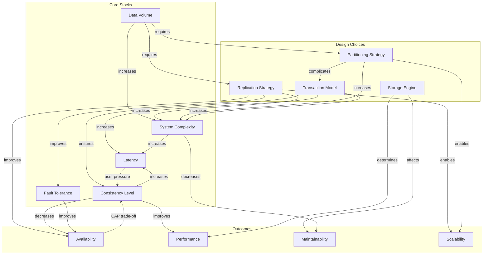

# Phase 1: The Architect - System Dynamics Model

## Book Information

- **Title:** Designing Data-Intensive Applications
- **Author:** Martin Kleppmann

---

## Ontological Extraction

### Stocks (Accumulations)

| Stock                     | Description                                             |
| :------------------------ | :------------------------------------------------------ |
| **Data Volume**           | Total amount of data stored in the system               |
| **Query Load**            | Number of read/write requests per unit time             |
| **System Complexity**     | Accumulated architectural and operational complexity    |
| **Technical Debt**        | Deferred maintenance and suboptimal design decisions    |
| **Operational Knowledge** | Team's understanding of system behavior                 |
| **Consistency Level**     | Degree of data coherence across replicas                |
| **Latency Budget**        | Available time for request processing                   |
| **Fault Tolerance**       | System's ability to continue operating despite failures |
| **Feature Velocity**      | Rate at which new features can be shipped               |
| **Data Correctness**      | Accuracy and integrity of stored data                   |

### Flows (Rates of Change)

| Flow                        | Description                                          |
| :-------------------------- | :--------------------------------------------------- |
| **Data Ingestion Rate**     | Speed at which new data enters the system            |
| **Query Throughput**        | Requests processed per second                        |
| **Replication Lag**         | Delay in propagating writes to followers             |
| **Partition Growth**        | Rate at which data partitions expand                 |
| **Complexity Accumulation** | Rate at which system complexity increases            |
| **Knowledge Decay**         | Rate at which operational expertise is lost          |
| **Failure Rate**            | Frequency of component/system failures               |
| **Recovery Rate**           | Speed of returning to normal operation after failure |
| **Schema Evolution Rate**   | Frequency of data model changes                      |
| **Coordination Overhead**   | Messages required for distributed consensus          |

---

## Causal Links

### Positive Links (S: Same Direction)

| From                     | To                    | Mechanism                                                                       |
| :----------------------- | :-------------------- | :------------------------------------------------------------------------------ |
| Data Volume              | System Complexity     | More data requires more sophisticated storage, indexing, and query optimization |
| Data Volume              | Partitioning Need     | Larger datasets eventually exceed single-node capacity                          |
| Replication              | Fault Tolerance       | More replicas mean more nodes can fail without data loss                        |
| Replication              | Read Scalability      | More replicas can serve more read requests                                      |
| Consistency Requirements | Coordination Overhead | Stronger consistency requires more cross-node communication                     |
| Consistency Requirements | Latency               | Coordination adds round-trips, increasing response time                         |
| Partitioning             | Write Scalability     | Distributing data allows parallel writes                                        |
| Denormalization          | Read Performance      | Pre-computed joins eliminate query-time work                                    |
| Denormalization          | Write Complexity      | Updates must propagate to multiple locations                                    |
| Caching                  | Read Performance      | Hot data served from memory, not disk                                           |
| Batch Processing         | Throughput            | Processing data in bulk amortizes fixed costs                                   |

### Negative Links (O: Opposite Direction)

| From               | To                 | Mechanism                                                                 |
| :----------------- | :----------------- | :------------------------------------------------------------------------ |
| Consistency Level  | Availability       | CAP theorem: strong consistency sacrifices availability during partitions |
| Latency            | Consistency        | Lower latency often requires weaker consistency guarantees                |
| Normalization      | Write Performance  | Normalized data requires updates in one place                             |
| Normalization      | Read Performance   | Joins required at query time                                              |
| Partitioning       | Join Performance   | Cross-partition joins require network round-trips                         |
| Replication        | Write Latency      | Synchronous replication waits for acknowledgments                         |
| Schema Flexibility | Query Optimization | Schemaless data harder for query planners to optimize                     |
| Simplicity         | Feature Richness   | Simple systems have fewer capabilities                                    |

### Delays

| Relationship                       | Delay Type   | Duration                                |
| :--------------------------------- | :----------- | :-------------------------------------- |
| Write → Replication                | Information  | Milliseconds (async) to seconds (sync)  |
| Schema Change → Full Propagation   | Processing   | Minutes to hours for large datasets     |
| Complexity → Operational Problems  | Maturation   | Months to years before issues manifest  |
| Technical Debt → Velocity Impact   | Accumulation | Gradual degradation over months         |
| Index Creation → Query Improvement | Processing   | Minutes to hours depending on data size |
| Training → Operational Competence  | Learning     | Weeks to months                         |

---

## Feedback Loops

### Reinforcing Loops (R)

**R1: The Complexity Spiral**

```
Data Volume ↑ → Partitioning Need ↑ → System Complexity ↑ → Operational Difficulty ↑ → Technical Debt ↑ → System Complexity ↑
```

As data grows, systems become more distributed, which increases complexity, making them harder to operate, leading to shortcuts and debt, which further increases complexity.

**R2: The Replication Lag Death Spiral**

```
Read Load ↑ → More Read Replicas ↑ → Replication Lag ↑ → Stale Reads ↑ → User Retries ↑ → Read Load ↑
```

Adding read replicas to handle load increases replication lag, causing stale data, which causes users to retry, adding more load.

**R3: The Scaling Success Loop**

```
System Capacity ↑ → User Adoption ↑ → Revenue ↑ → Infrastructure Investment ↑ → System Capacity ↑
```

Better systems attract more users, generating revenue that enables further investment in capacity.

**R4: The Knowledge Accumulation Loop**

```
System Understanding ↑ → Better Design Decisions ↑ → Fewer Incidents ↑ → Time for Learning ↑ → System Understanding ↑
```

Teams that understand their systems make better decisions, experience fewer fires, and have more time to learn.

### Balancing Loops (B)

**B1: The Consistency-Availability Trade-off**

```
Consistency Requirements ↑ → Coordination Overhead ↑ → Latency ↑ → User Experience ↓ → Consistency Requirements ↓
```

Pushing for stronger consistency increases latency, degrading user experience, which creates pressure to relax consistency.

**B2: The Partition Rebalancing Loop**

```
Partition Skew ↑ → Hot Spots ↑ → Rebalancing Triggered → Data Movement ↑ → Partition Skew ↓
```

Skewed partitions cause hot spots, triggering rebalancing that redistributes data to eliminate skew.

**B3: The Caching Equilibrium**

```
Cache Miss Rate ↑ → Database Load ↑ → Latency ↑ → Cache Size Increase → Cache Hit Rate ↑ → Cache Miss Rate ↓
```

High miss rates cause DB pressure, prompting cache expansion until miss rates stabilize.

**B4: The Capacity Planning Loop**

```
Utilization ↑ → Performance Degradation ↑ → Scaling Triggered → Capacity ↑ → Utilization ↓
```

High utilization degrades performance, triggering scaling that reduces utilization.

---

## System Dynamics Diagram



---

## Leverage Points

### High Leverage

| Leverage Point                   | Impact                                           | Intervention                                                                                 |
| :------------------------------- | :----------------------------------------------- | :------------------------------------------------------------------------------------------- |
| **Data Model Choice**            | Determines all downstream complexity             | Choose the right model (relational, document, graph) for your access patterns BEFORE scaling |
| **Consistency Requirements**     | Sets the ceiling for availability and latency    | Define minimum necessary consistency; avoid "strong by default"                              |
| **Partitioning Key Selection**   | Determines scalability ceiling and hot spot risk | Select keys that distribute writes evenly AND match query patterns                           |
| **Synchronous vs. Asynchronous** | Defines durability-latency trade-off             | Use async replication unless durability justifies the latency cost                           |

### Medium Leverage

| Leverage Point                  | Impact                             | Intervention                                                           |
| :------------------------------ | :--------------------------------- | :--------------------------------------------------------------------- |
| **Index Strategy**              | Read vs. write performance balance | Design indexes for actual queries, not theoretical ones                |
| **Caching Layer**               | Reduces DB load, adds complexity   | Cache at the right layer (application, database, CDN)                  |
| **Batch vs. Stream Processing** | Latency vs. throughput trade-off   | Use batch for high-volume analytics, stream for real-time requirements |
| **Schema Evolution Strategy**   | Determines deployment flexibility  | Choose encoding formats (Avro, Protobuf) that support schema evolution |

### Low Leverage

| Leverage Point             | Impact                                      | Intervention                                                      |
| :------------------------- | :------------------------------------------ | :---------------------------------------------------------------- |
| **Hardware Upgrades**      | Linear improvement, diminishing returns     | Vertical scaling buys time but doesn't solve architectural issues |
| **Query Optimization**     | Marginal gains after fundamentals are right | Optimize only after data model and indexes are correct            |
| **Monitoring Granularity** | Better visibility, doesn't fix root causes  | Monitoring reveals problems; doesn't solve them                   |

---

## Core Thesis Extraction

The book's central argument can be reduced to a single system dynamics principle:

> **In data-intensive systems, architectural decisions create trade-offs that propagate through feedback loops. The key to success is understanding which trade-offs matter for your specific access patterns and accepting the consequences of your choices.**

Three meta-principles govern all decisions:

1. **Reliability**: The system should work correctly even when things go wrong (hardware, software, humans)
2. **Scalability**: The system should handle growth in data, traffic, or complexity
3. **Maintainability**: The system should be understandable, adaptable, and operable by humans over time

These three goals exist in constant tension—optimizing one often compromises another.

---

## Sources

- Kleppmann, M. (2017). _Designing Data-Intensive Applications_. O'Reilly Media.
- Meadows, D. (2008). _Thinking in Systems_. Chelsea Green Publishing.
- Helland, P. (2012). "Idempotence Is Not a Medical Condition." _ACM Queue_.
- Brewer, E. (2012). "CAP Twelve Years Later: How the Rules Have Changed." _IEEE Computer_.
- Bailis, P., & Ghodsi, A. (2013). "Eventual Consistency Today: Limitations, Extensions, and Beyond." _ACM Queue_.
