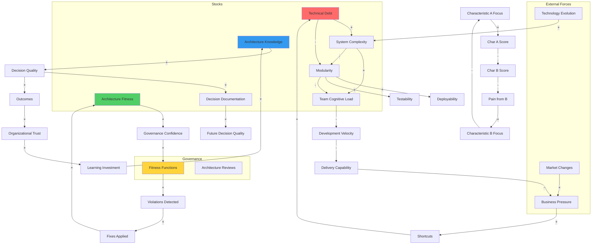

# Phase 1: The Architect - System Dynamics Model

## Book Information
- **Title:** Fundamentals of Software Architecture: An Engineering Approach
- **Author:** Mark Richards & Neal Ford

---

## Ontological Extraction

### Stocks (Accumulations)

| Stock | Description |
|:------|:------------|
| **Architecture Knowledge** | Team's understanding of architecture principles, patterns, and trade-offs |
| **Technical Debt** | Accumulated shortcuts, coupling, and architectural violations |
| **System Complexity** | Overall complexity of the architecture (coupling, dependencies, surface area) |
| **Architecture Fitness** | Degree to which architecture supports current business needs |
| **Modularity** | Level of component independence and clear boundaries |
| **Coupling** | Degree of interdependence between components |
| **Architecture Characteristics Score** | Aggregate score across supported -ilities (scalability, security, etc.) |
| **Decision Documentation** | Accumulated ADRs capturing rationale for choices |
| **Team Cognitive Load** | Mental burden of understanding and working within the architecture |

### Flows (Rates of Change)

| Flow | Description |
|:-----|:------------|
| **Learning Rate** | Rate at which team acquires architecture knowledge |
| **Debt Accumulation Rate** | Speed of technical debt creation from shortcuts |
| **Debt Repayment Rate** | Speed of technical debt reduction through refactoring |
| **Complexity Growth Rate** | Rate at which system complexity increases |
| **Characteristic Degradation Rate** | Speed at which architecture characteristics erode |
| **Fitness Function Feedback Rate** | Frequency of automated governance checks |
| **Decision Velocity** | Rate of architectural decision-making |
| **Evolution Rate** | Speed of intentional architectural change |

---

## Causal Links

### Positive Links (S: Same Direction)

| From | To | Mechanism |
|:-----|:---|:----------|
| Architecture Knowledge | Decision Quality | Better knowledge leads to better trade-off analysis |
| Technical Debt | System Complexity | Accumulated shortcuts increase coupling and complexity |
| System Complexity | Team Cognitive Load | More complex systems require more mental effort |
| Modularity | Deployability | Independent modules enable independent deployment |
| Fitness Functions | Architecture Fitness | Automated checks maintain characteristic health |
| Business Pressure | Debt Accumulation Rate | Urgency leads to shortcuts |
| Architecture Quanta Clarity | Team Autonomy | Clear boundaries enable independent team work |
| ADR Documentation | Future Decision Quality | Captured rationale informs future choices |

### Negative Links (O: Opposite Direction)

| From | To | Mechanism |
|:-----|:---|:----------|
| Technical Debt | Architecture Fitness | Debt degrades ability to support characteristics |
| Coupling | Modularity | High coupling prevents independent modules |
| Team Cognitive Load | Development Velocity | Overwhelmed teams work slower |
| Complexity | Testability | Complex systems are harder to test |
| Characteristic Trade-offs | Individual Characteristic Score | Improving one characteristic degrades others |
| Fitness Function Failures | Deployment Velocity | Failed checks block releases |
| Security Investment | Performance | Security measures add latency |

### Delays

| Relationship | Delay Type | Duration |
|:-------------|:-----------|:---------|
| Technical Debt → System Failure | Accumulating | Months to years |
| Architecture Decision → Observable Consequence | Implementation | Weeks to months |
| Fitness Function Implementation → Behavior Change | Adoption | Weeks |
| Knowledge Investment → Improved Decisions | Learning | Months |
| Refactoring → Debt Reduction | Execution | Weeks to months |
| Characteristic Change → Business Impact | Realization | Months |

---

## Feedback Loops

### Reinforcing Loops (R)

**R1: Technical Debt Spiral**
```
Business Pressure → Shortcuts → Technical Debt → System Complexity
→ Development Slowdown → More Pressure → More Shortcuts
```
*Description:* Pressure leads to shortcuts, creating debt that slows development, creating more pressure for shortcuts. Classic "death spiral" in software projects.

**R2: Architecture Knowledge Flywheel**
```
Architecture Knowledge → Better Decisions → Better Outcomes
→ Organizational Trust → Investment in Learning → More Knowledge
```
*Description:* Teams that demonstrate architecture value earn investment in further learning, compounding their capability.

**R3: Modularity Momentum**
```
Modularity → Faster Changes → Business Value → Investment in Modularity
```
*Description:* Well-modularized systems enable faster delivery, which justifies further modularity investment.

**R4: Fitness Function Governance Loop**
```
Fitness Functions → Violations Detected → Fixes Applied
→ Improved Characteristics → Confidence in Governance → More Fitness Functions
```
*Description:* Successful fitness functions build confidence, leading to more comprehensive automated governance.

### Balancing Loops (B)

**B1: Characteristic Trade-off Balance**
```
Focus on Characteristic A → Improvement in A → Degradation in B
→ Pain from B → Shift Focus to B → Improvement in B → Degradation in A
```
*Description:* The First Law in action. Optimizing for one characteristic eventually causes enough pain in others to force rebalancing.

**B2: Complexity Cost Control**
```
System Complexity → Team Cognitive Load → Errors/Slowdown
→ Refactoring Pressure → Simplification → Reduced Complexity
```
*Description:* Rising complexity eventually becomes painful enough to justify simplification investment.

**B3: Architecture Quantum Equilibrium**
```
Service Granularity (Fine) → Coordination Overhead → Development Friction
→ Consolidation Pressure → Service Granularity (Coarse)
```
*Description:* Over-decomposed services create coordination costs that push toward consolidation, while monoliths create coupling that pushes toward decomposition. Systems oscillate toward equilibrium.

**B4: Documentation Decay Loop**
```
ADR Documentation → Maintenance Burden → Stale Documentation
→ Reduced Trust → Reduced Documentation Effort
```
*Description:* Documentation requires maintenance; without it, trust erodes and documentation effort decreases.

---

## System Dynamics Diagram



---

## Leverage Points

### High Leverage

| Leverage Point | Intervention | Impact |
|:---------------|:-------------|:-------|
| **Fitness Functions** | Automate architecture governance in CI/CD | Prevents characteristic degradation before it accumulates; shifts feedback from months to minutes |
| **Architecture Quantum Definition** | Clearly define deployment boundaries | Enables independent team work, reduces coordination overhead, allows different characteristics per quantum |
| **ADR Practice** | Document decisions with rationale | Breaks the "why did we do this?" cycle; compounds decision quality over time |
| **Characteristic Prioritization** | Explicitly limit to 3-5 characteristics | Prevents "boiling the ocean"; focuses trade-off analysis on what matters |

### Medium Leverage

| Leverage Point | Intervention | Impact |
|:---------------|:-------------|:-------|
| **Technical Debt Visibility** | Track and visualize debt metrics | Creates organizational pressure for debt repayment |
| **Architecture Katas** | Regular practice exercises | Builds architecture knowledge without production risk |
| **Connascence Analysis** | Evaluate coupling type, not just presence | Enables smarter coupling decisions (weak connascence is acceptable) |
| **Domain Partitioning** | Organize by business capability, not technical layer | Reduces cross-team dependencies, improves cohesion |

### Low Leverage

| Leverage Point | Intervention | Impact |
|:---------------|:-------------|:-------|
| **Architecture Style Selection** | Choose "right" pattern | Matters less than executing any pattern well |
| **Tooling Choices** | Select specific technologies | Often reversible; less impactful than structural decisions |
| **Documentation Format** | Standardize diagram notation | Helps communication but doesn't change dynamics |

---

## Key System Insights

### Insight 1: The First Law Creates Oscillation
The characteristic trade-off balancing loop (B1) means systems naturally oscillate between optimizing different characteristics. This is unavoidable—the goal is to make trade-offs explicit, not to eliminate them.

### Insight 2: Fitness Functions Break Delay Loops
Without automated governance, architecture degradation has long delays before consequences appear. Fitness functions shorten feedback loops from months to minutes, enabling corrective action before debt accumulates.

### Insight 3: Architecture Quanta Enable Local Optimization
By defining clear quantum boundaries, teams can optimize for different characteristics in different quanta. Custody systems can prioritize security; trading systems can prioritize performance.

### Insight 4: Knowledge Compounds; Debt Compounds Faster
Both architecture knowledge and technical debt are reinforcing loops, but debt accumulates faster because shortcuts are immediate while learning takes time. Without active intervention, debt wins.

### Insight 5: Modularity is the Meta-Characteristic
High modularity enables most other characteristics (deployability, testability, scalability). Investing in modularity has outsized returns.

---

## Sources

- Richards, M. & Ford, N. (2020). *Fundamentals of Software Architecture*. O'Reilly Media.
- [Book Companion Website](http://fundamentalsofsoftwarearchitecture.com/)
- [Architecture Katas List](http://fundamentalsofsoftwarearchitecture.com/katas/list.html)
- Meadows, D. (2008). *Thinking in Systems*. Chelsea Green Publishing.
- [Dan Lebrero's Book Summary](https://danlebrero.com/2021/11/17/fundamentals-of-software-architecture-summary/)
